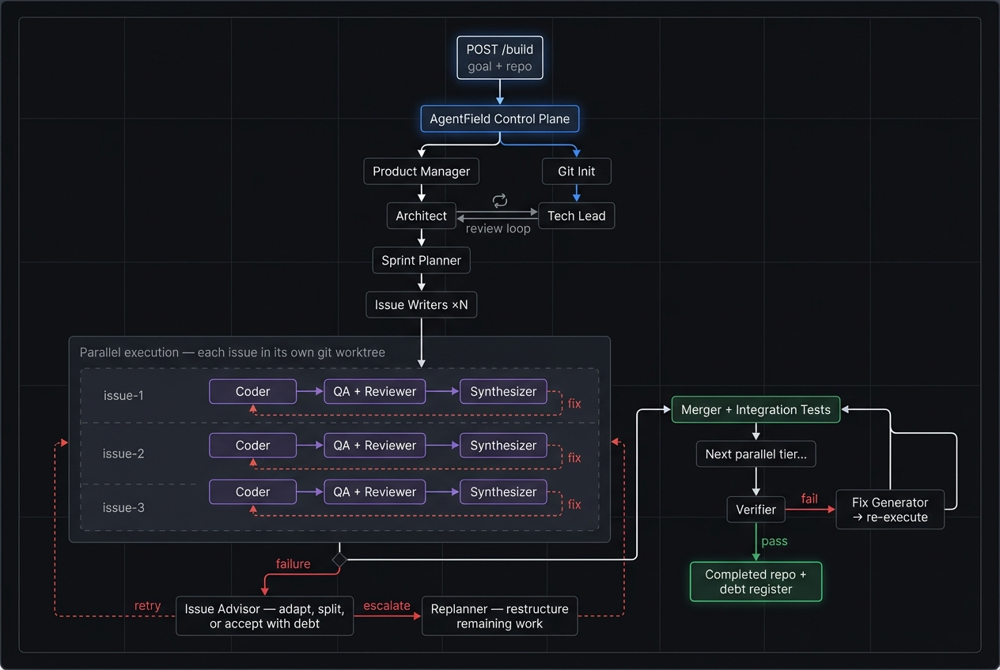

# SWE AgentNode

Production-grade software engineering, not vibe coding. One API call deploys hundreds of autonomous coding agents that architect, code, test, review, and verify in parallel — and delivers tested, reviewed, integration-verified code with a debt register for anything compromised.

```bash
curl -X POST http://localhost:8080/api/v1/execute/async/swe-planner.build \
  -H "Content-Type: application/json" \
  -d '{"input": {"goal": "Add JWT auth to all API endpoints", "repo_path": "/path/to/repo"}}'
```

**What happens:**

- Architecture designed and peer-reviewed before any code is written
- Issues decomposed, dependency-ordered, and executed in parallel across isolated worktrees
- Every issue coded, tested, and reviewed independently — failures loop back up to 5 times
- Integration tested after each merge tier, verified against original acceptance criteria
- Anything relaxed, skipped, or compromised is tracked in a **debt register**



> Every box is an independent agent instance with full tool use, file system access, and git operations. A typical build deploys **400-500+ agent instances** across parallel worktrees. Tested up to 10,000.

## How it works

Three nested self-correction loops:

**Inner** — Coder → QA → Reviewer → Synthesizer. Tests fail? Feed errors back. Loops up to 5×.
**Middle** — Issue Advisor. Loop exhausted? Change approach, split, relax requirements (recorded as debt), or escalate.
**Outer** — Replanner. Issue stuck? Rewrite remaining issues, reduce scope, route around the failure. The plan reshapes itself at runtime.

## Quick start

```bash
python3 -m pip install -r requirements.txt
af                 # control plane on :8080
python3 main.py    # registers "swe-planner" node
```

Stateless nodes register with the [AgentField](https://agentfield.ai) control plane. Run on a laptop, container, or Lambda. Scale by adding nodes. Crash-safe — call `resume_build` to pick up where you left off.

<details>
<summary><strong>Docker</strong></summary>

```bash
# Set your API keys
cp .env.example .env
# Edit .env with your ANTHROPIC_API_KEY (and GH_TOKEN for draft PRs)

# Start control plane + SWE agent
docker compose up -d

# Submit a build (local repo on shared volume)
curl -X POST http://localhost:8080/api/v1/execute/async/swe-planner.build \
  -H "Content-Type: application/json" \
  -d '{"input": {"goal": "Add JWT auth", "repo_path": "/workspaces/my-repo"}}'

# Or: clone from GitHub and get a draft PR back
curl -X POST http://localhost:8080/api/v1/execute/async/swe-planner.build \
  -H "Content-Type: application/json" \
  -d '{"input": {"repo_url": "https://github.com/user/my-repo", "goal": "Add JWT auth"}}'

# Scale to 3 replicas for parallel builds
docker compose up --scale swe-agent=3 -d
```

All replicas share a `/workspaces` volume for repos, worktrees, and artifacts. The control plane load-balances `app.call()` across all registered nodes.

**Using an existing control plane** (no Docker control plane):

```bash
# If you already have `af` running on localhost:8080
docker compose -f docker-compose.local.yml up -d
```

This uses `host.docker.internal` to connect from the container to your host's control plane.

</details>

<details>
<summary><strong>GitHub Workflow (Clone → Build → Draft PR)</strong></summary>

Pass `repo_url` instead of `repo_path` to clone a GitHub repo automatically. After the build completes, a draft PR is created.

```bash
curl -X POST http://localhost:8080/api/v1/execute/async/swe-planner.build \
  -H "Content-Type: application/json" \
  -d '{"input": {
    "repo_url": "https://github.com/user/my-project",
    "goal": "Add comprehensive test coverage",
    "config": {"preset": "quality"}
  }}'
```

**What happens:**
1. Repo cloned to `/workspaces/my-project`
2. Full pipeline: plan → execute → verify
3. Integration branch pushed to origin
4. Draft PR created with build summary

**Requirements:**
- `GH_TOKEN` set in `.env` (GitHub personal access token with `repo` scope)
- Remote repo must be accessible (public or token has access)

**Config options:**
| Key | Default | |
|-----|---------|---|
| `repo_url` | `""` | GitHub URL to clone |
| `enable_github_pr` | `true` | Create draft PR after build |
| `github_pr_base` | `""` | PR base branch (auto-detected from remote default) |

</details>

<details>
<summary><strong>API Reference</strong></summary>

### Core endpoints

Async via the control plane. Returns `execution_id` immediately. All with `-H "Content-Type: application/json"`.

```bash
# Full pipeline: plan → execute → verify
curl -X POST http://localhost:8080/api/v1/execute/async/swe-planner.build \
  -d '{"input": {"goal": "...", "repo_path": "...", "config": {}}}'

# Plan only
curl -X POST http://localhost:8080/api/v1/execute/async/swe-planner.plan \
  -d '{"input": {"goal": "...", "repo_path": "..."}}'

# Execute a pre-made plan
curl -X POST http://localhost:8080/api/v1/execute/async/swe-planner.execute \
  -d '{"input": {"plan_result": { ... }, "repo_path": "..."}}'

# Resume after crash
curl -X POST http://localhost:8080/api/v1/execute/async/swe-planner.resume_build \
  -d '{"input": {"repo_path": "...", "artifacts_dir": ".artifacts"}}'
```

### Every agent is an endpoint

`POST /api/v1/execute/async/swe-planner.<agent>`

| Agent | In → Out |
|-------|----------|
| `run_product_manager` | goal → PRD |
| `run_architect` | PRD → architecture |
| `run_tech_lead` | architecture → review |
| `run_sprint_planner` | architecture → parallelized issues |
| `run_issue_writer` | issue spec → detailed issue file |
| `run_coder` | issue + worktree → code + tests + commit |
| `run_qa` | worktree → test results |
| `run_code_reviewer` | worktree → quality/security review |
| `run_qa_synthesizer` | QA + review → FIX / APPROVE / BLOCK |
| `run_issue_advisor` | failure context → adapt / split / accept / escalate |
| `run_replanner` | DAG state + failures → restructured plan |
| `run_merger` | branches → merged with conflict resolution |
| `run_integration_tester` | merged repo → integration test results |
| `run_verifier` | repo + PRD → acceptance pass/fail |
| `generate_fix_issues` | failed criteria → targeted fix issues |
| `run_github_pr` | integration branch → push + draft PR |

### Monitoring

```bash
curl http://localhost:8080/api/v1/executions/<execution_id>
```

</details>

<details>
<summary><strong>Configuration</strong></summary>

Pass `config` to `build` or `execute`. All optional. Full schema: [`execution/schemas.py`](execution/schemas.py)

| Key | Default | |
|-----|---------|---|
| `max_coding_iterations` | `5` | Inner loop budget per issue |
| `max_advisor_invocations` | `2` | Middle loop budget per issue |
| `max_replans` | `2` | Outer loop budget per build |
| `enable_issue_advisor` | `true` | Enable middle loop |
| `enable_replanning` | `true` | Enable outer loop |
| `agent_timeout_seconds` | `2700` | Per-agent timeout |
| `ai_provider` | `"claude"` | `"claude"` or `"codex"` |
| `coder_model` | `"sonnet"` | Model for coding |
| `agent_max_turns` | `150` | Tool-use turns per agent |

### Model configuration

Use **presets** and **role groups** instead of setting 16 individual `*_model` fields.

#### Presets

| Preset | Planning | Coding | Orchestration | Lightweight | Use case |
|--------|----------|--------|---------------|-------------|----------|
| `turbo` | haiku | haiku | haiku | haiku | Pipeline testing, rapid prototyping |
| `fast` | sonnet | sonnet | haiku | haiku | Good code quality, cheap orchestration |
| **`balanced`** | sonnet | sonnet | sonnet | haiku | **Default.** Production quality |
| `thorough` | sonnet | sonnet | sonnet | sonnet | Uniform sonnet everywhere |
| `quality` | opus | opus | sonnet | haiku | Best planning + coding |

#### Role groups

| Group | Agents |
|-------|--------|
| `planning` | Product Manager, Architect, Tech Lead, Sprint Planner |
| `coding` | Coder, QA, Code Reviewer |
| `orchestration` | Replanner, Retry Advisor, Issue Writer, Verifier, Git, Merger, Integration Tester, Issue Advisor |
| `lightweight` | QA Synthesizer (FIX/APPROVE/BLOCK routing) |

#### Layered resolution

Precedence (lowest → highest): **defaults** < **preset** < **role groups** < **individual fields**

```bash
# Preset only — opus planning+coding, sonnet orchestration, haiku lightweight
curl -X POST .../swe-planner.build \
  -d '{"input": {"goal": "...", "repo_path": "...", "config": {"preset": "quality"}}}'

# Group override — opus planning, everything else uses defaults
curl -X POST .../swe-planner.build \
  -d '{"input": {"goal": "...", "repo_path": "...", "config": {"models": {"planning": "opus"}}}}'

# Preset + group override — quality preset but cheap orchestration
curl -X POST .../swe-planner.build \
  -d '{"input": {"goal": "...", "repo_path": "...", "config": {"preset": "quality", "models": {"orchestration": "haiku"}}}}'

# Preset + individual override — balanced but architect uses opus
curl -X POST .../swe-planner.build \
  -d '{"input": {"goal": "...", "repo_path": "...", "config": {"preset": "balanced", "architect_model": "opus"}}}'

# Backward compatible — individual *_model fields still work
curl -X POST .../swe-planner.build \
  -d '{"input": {"goal": "...", "repo_path": "...", "config": {"pm_model": "opus", "architect_model": "opus"}}}'

# Top-level model= convenience — sets all 16 fields to the same value
curl -X POST .../swe-planner.build \
  -d '{"input": {"goal": "...", "repo_path": "...", "model": "opus"}}'
```

Presets and groups are the recommended approach. Individual `*_model` fields are available for fine-tuning.

</details>

<details>
<summary><strong>Artifacts</strong></summary>

```
.artifacts/
├── plan/           # PRD, architecture, issue specs
├── execution/      # checkpoint, per-issue iterations, agent logs
└── verification/   # acceptance criteria results
```

</details>

## Requirements

- Python 3.11+
- [AgentField](https://agentfield.ai) control plane
- Anthropic or OpenAI API key

## Development

```bash
make test          # unit tests
make check         # tests + bytecode compile check
make clean         # remove generated Python/editor cache files
make clean-examples  # remove Rust build outputs in example folders
```

`examples/diagrams/` and `examples/pyrust/` are included in git so users can inspect full example outputs, including `.artifacts/logs`.

## Internals

- Architecture: [ARCHITECTURE.md](ARCHITECTURE.md)
- Contribution guide: [CONTRIBUTING.md](CONTRIBUTING.md)
- License: [Apache-2.0](LICENSE)
